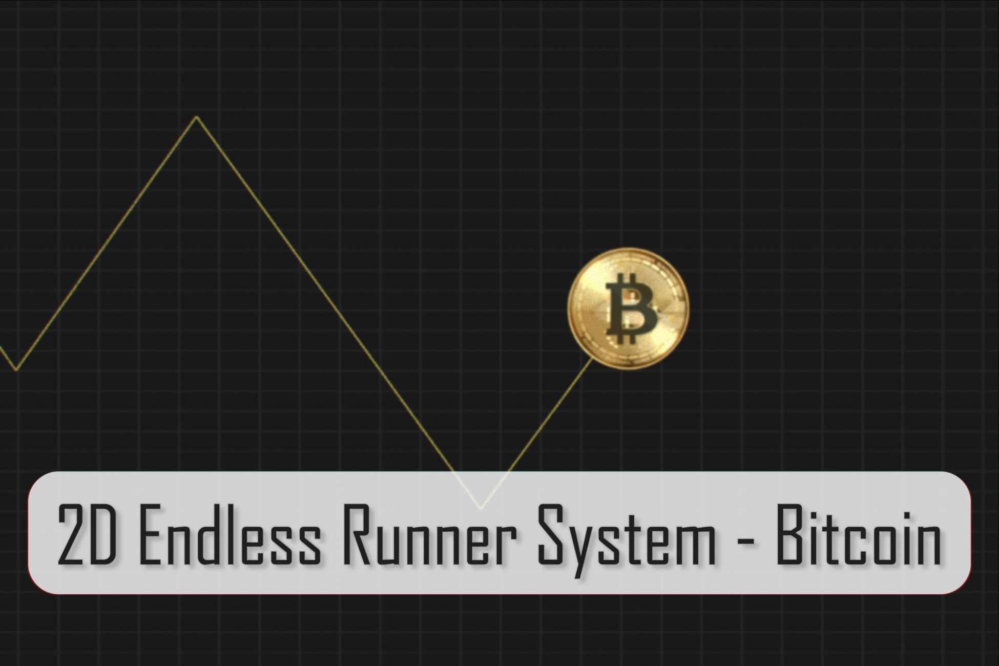
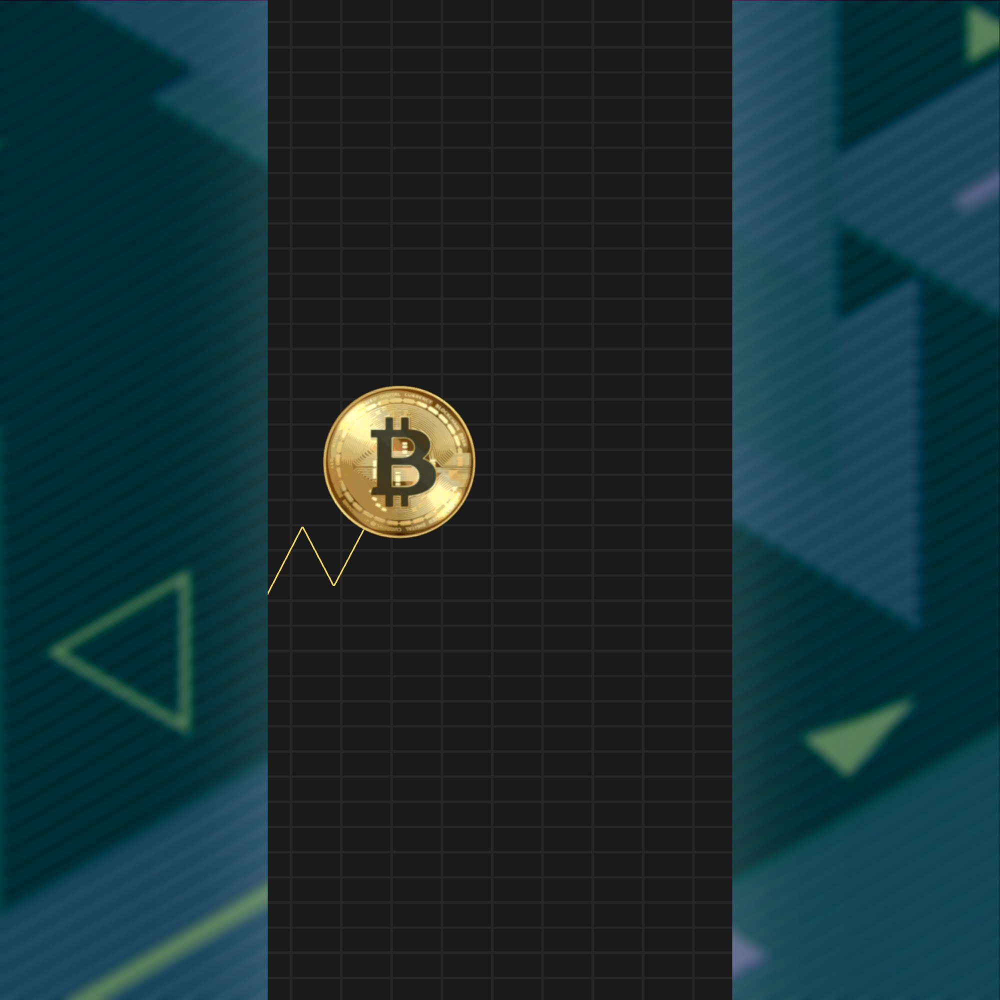
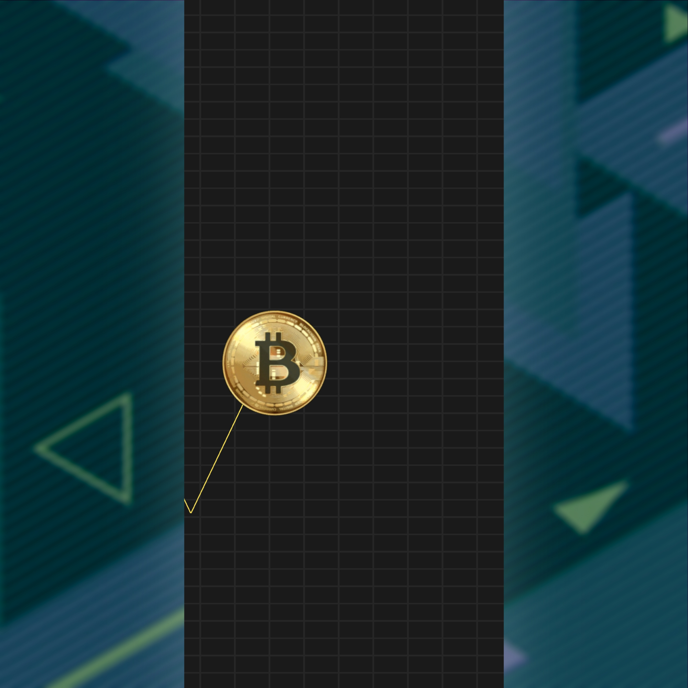
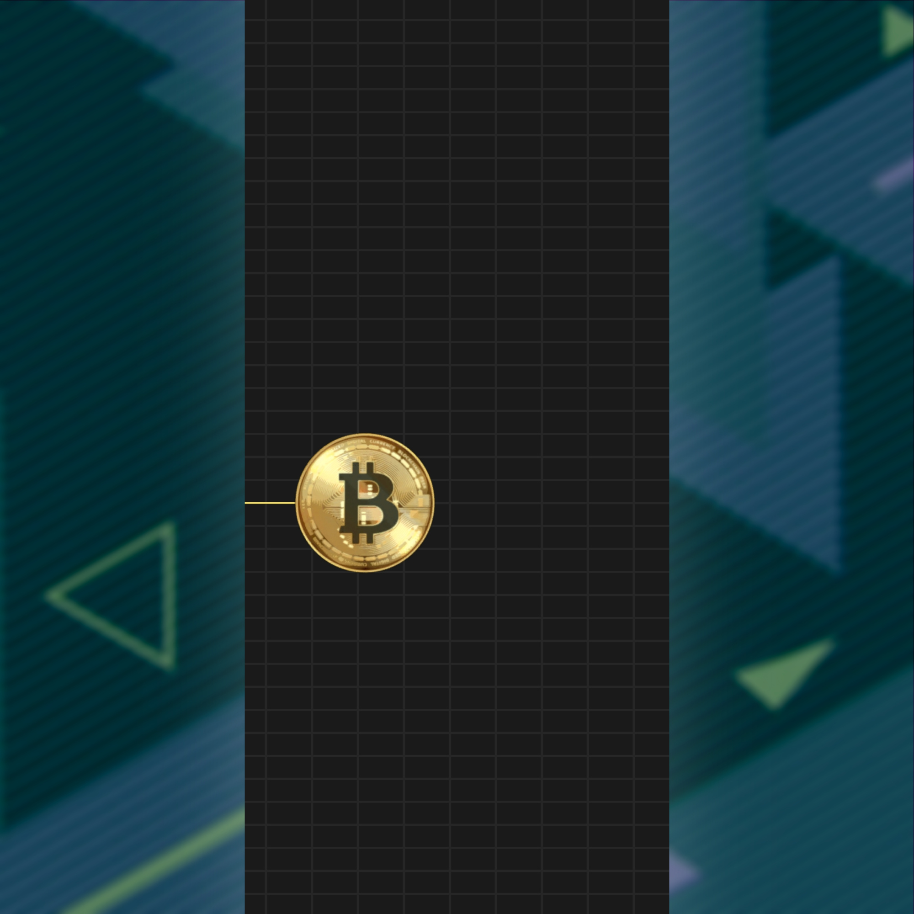
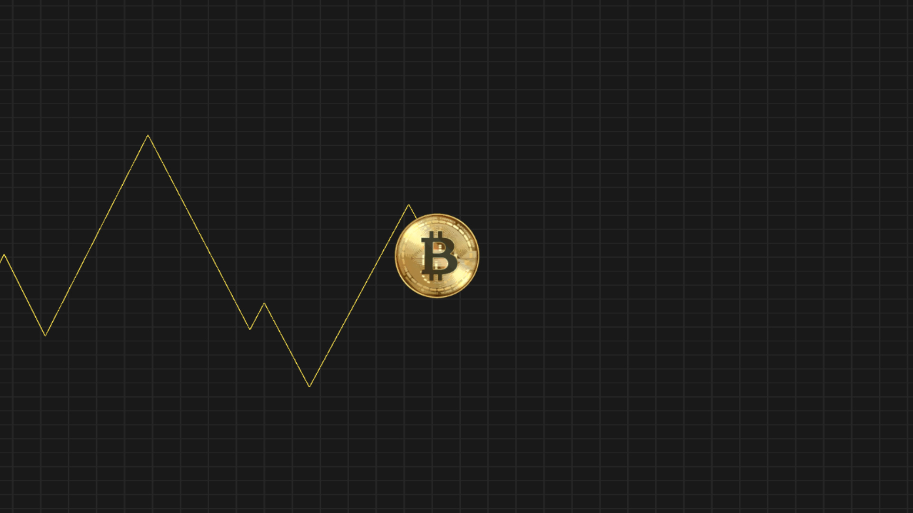

# 2D Endless Runner System - Bitcoin
A simple endless runner system about bitcoins, optimized for mobile devices.

In this mini-game, you act as a bitcoin that changes the direction of its movement by tapping on the screen. One of the features of this project is the implementation of leaving a trace behind the player. Add environment, obstacles and enemies to end up with an entertaining game.

Supported platforms: Android/IOS/PC

# Screenshots

